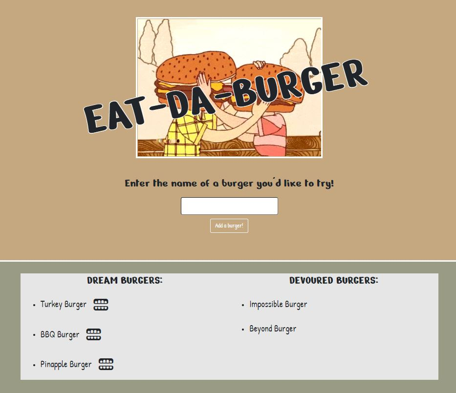

# EAT-DA-BURGER :hamburger: :hamburger:

Since it's the year 2020 and food is one of the few things we can enjoy right now, I've created an application which will keep track of the types of burgers you'd like to try and allows you to mark off each one as you have the chance to eat them. This application utilizes a MySQL database to store the burger data that the user enters and uses Handlebars to template the burger database into the HTML to provide the user with the lists of burgers they have and haven't yet tried!

[Heroku Link](https://stormy-ocean-46833.herokuapp.com/)

## TABLE OF CONTENTS

-[Features](#Features)

-[Dependencies](#Dependencies)

-[Screenshots](#Screenshots)

-[Contact](#Contact)

## FEATURES

-When the user first visits the application they will be prompted to enter the name of a burger they're dreaming of. A MySQL database will store the name of the burger as well as a boolean for if you have tried it or not yet (defaults to not having tried it).

-Using Handlebars, the data from MySQL is pulled into the lists towards the bottom of the page which will display the burgers you're dreaming of eating, and ones you've already tried.

-Uses FontAwesome icons as a button to "devour" each of the burgers under the "dream burger" list.

## DEPENDENCIES

-[Express-Handlebars](https://www.npmjs.com/package/express-handlebars)

-[MySQL](https://www.npmjs.com/package/mysql)

-[Method-Override](https://www.npmjs.com/package/method-override)

-[Express](https://www.npmjs.com/package/express)

-[Node](https://www.npmjs.com/package/node)

## SCREENSHOTS

## CONTACT

:link: https://github.com/ethanrmcdowell
  
:e-mail: ethan.r.mcdowell@gmail.com
